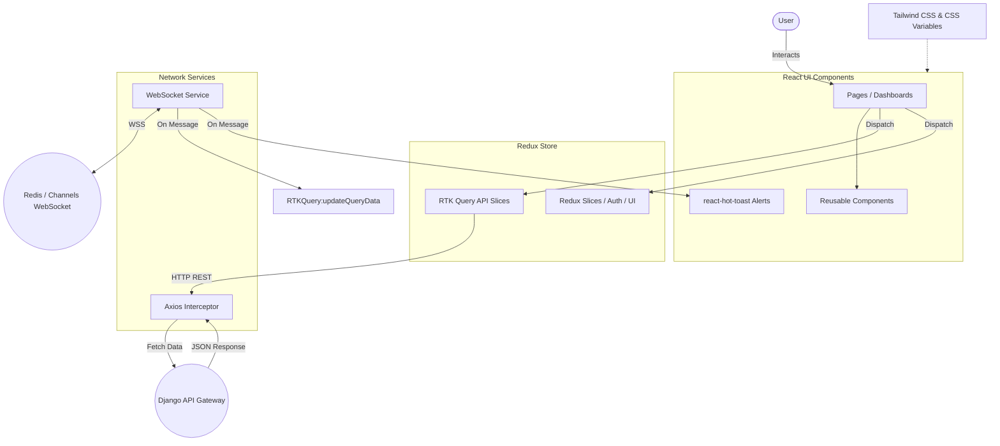

# Frontend Architecture

The frontend for Audicle Intelligence is built as a Single Page Application (SPA) using React and Vite. 

## Tech Stack
- **Framework**: React 18
- **Build Tool**: Vite
- **Styling**: Tailwind CSS & Vanilla CSS modules (with heavily customized theme tokens for dark mode and glassmorphism)
- **State Management**: Redux Toolkit (RTK) and RTK Query
- **Routing**: React Router DOM
- **Icons**: Lucide React

## High-Level Workflow Diagram



## Directory Structure
The `src/` directory is organized using a feature-based architecture to keep code modular and maintainable:
```
src/
├── app/              # Redux store configuration and root reducer
├── assets/           # Images, SVGs, global CSS styles
├── components/       # Shared UI components (Layout, Topbar, Sidebar)
├── features/         # Feature-specific logic (auth, meetings, notifications, settings)
├── hooks/            # Global custom React hooks
├── pages/            # Top-level page components matching routes
├── services/         # API configurations (Axios, WebSocket instances)
└── utils/            # Helper functions and constants
```

## State Management & Data Fetching
We use **Redux Toolkit Query (RTK Query)** for all data fetching. It automatically handles caching, loading states, and deduplication of requests.
- Endpoints are defined in feature-specific API slices (e.g., `notificationsApi.js`, `meetingsApi.js`).
- RTK Query auto-generates hooks like `useGetNotificationsQuery()` which are consumed directly by the React components.

## Real-Time Notifications
The frontend maintains a persistent WebSocket connection to the Django backend to receive live updates when background tasks (like transcriptions or summarization) complete.
1. `websocketService.js` manages the raw WebSocket connection, handles reconnects, and auto-attaches the JWT token.
2. The `useNotificationSocket()` hook listens for incoming messages.
3. Upon receiving a message, it uses Redux's `updateQueryData` to safely inject the new notification into the RTK Query cache without requiring a full page refresh.
4. It also triggers a dynamic `react-hot-toast` to alert the user immediately.

## Theme & UI
The UI is designed to be highly modern and dynamic:
- **Tailwind Config**: Uses custom CSS variables defined in `index.css` to allow seamless switching between light and dark themes.
- **Glassmorphism**: Extensive use of `backdrop-blur`, subtle borders, and semi-transparent backgrounds to create depth.
- **Responsive Layout**: The dashboard adapts seamlessly from desktop sidebars to mobile bottom navigation.
